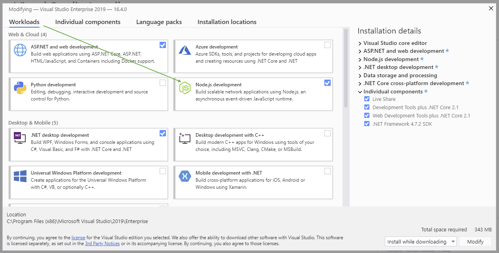
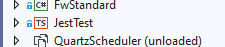
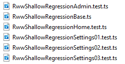

# How to run Regresssion Tests locally

Last Updated 12/13/2020

### Ensure the Node.js Development Environment is installed
- Click on 'Tools' in the navigation, choose 'Get Tools and Features'. This will bring up the VS installer.
- Under the 'Workloads' tab, if Node.js development is not checked, check the box and choose 'Modify' in the lower right.
   
- After the package downloads and installs, Visual Studio will be restarted.
- Find 'JestTest' in the solution explorer.  If the project is unloaded, then right-click and choose 'reload project'.
   

### Create a new environment file
- The test scripts use a local file called .env, which is intentionally excluded from the repository.  You need to create your own local copy of this file.
- Right-click the 'JestTest' root directory in Visual Studio.  Choose 'Add', then 'New Item'. Disregard file type options, name it '.env', and click 'Add'.
- Copy and paste the code below into the file, substituting 'youremail' and 'yourpassword' with your actual username and password used to sign into RWW (or a test account).
```
RW_LOGIN=youremail
RW_PASSWORD=yourpassword
RW_URL=http://localhost/rentalworksweb
```

### Open a Terminal window
- Open a Terminal window. From Windows Explorer, navigate to the src folder within the RentalWorksWeb directory.
 - Option 1: Right-click 'JestTest' and choose 'Git bash here' (if installed)
 - Option 2: Hold the Shift button, and right-click 'JestTest' and click Open PowerShell window here

### Install Puppeteer 
- Install the Puppeteer Node package which is what allows you to programatically control Chrome
```
npm i puppeteer
```

### Install Jest 
- Install the Jest testing framework.  This is what allows you to write logical tests in TypeScript.
```
npm i jest
```

### Install Jest HTML Reporting Tool
- Install this reporting package for Jest.  This allows Jest to save its output to a nice file format
```
npm i jest-html-reporter
```
- here is a link to the reporting software for reference https://www.npmjs.com/package/jest-html-reporter

### Run a single Test
- Start by building and running RentalWorks locally 
- Run the test command.  Here is an example:
```
npx jest --config=jest.rentalworksweb.config.js "RwwShallowRegressionAdmin"
```
- The above command will run the src\ts\rentalworksweb\RwwShallowRegressionAdmin.test.ts test using the configuration stored in jest.rentalworksweb.config.js 

### Run multiple tests using NPM commands
- You can also use npm to run test collections, like this:
```
npm run test-rentalworksweb -t rwwshallow
```
- 'npm run' initializes the command string
- The keyword 'test' is hypened with the directory where the tests are located (ie. rentalworksapi OR rentalworksweb)
 - Note, test directories are located within \JestTest\src\ts
- The '-t' flag and succeeding string can be utilized in order to target a particular test name or group of tests. It will target filename partial matches and is not case-sensitive.  The example above will run all of the Shallow tests shown here:
   
- Without the '-t' flag and search string, the program will run ALL files in the directory ending with the .test.ts file extension.