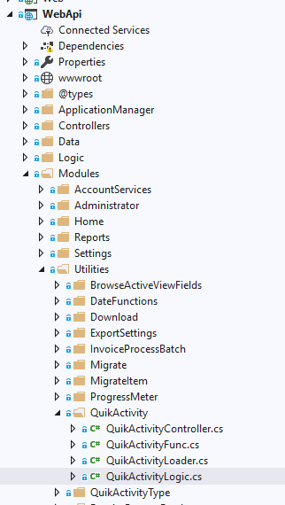
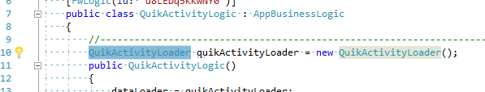
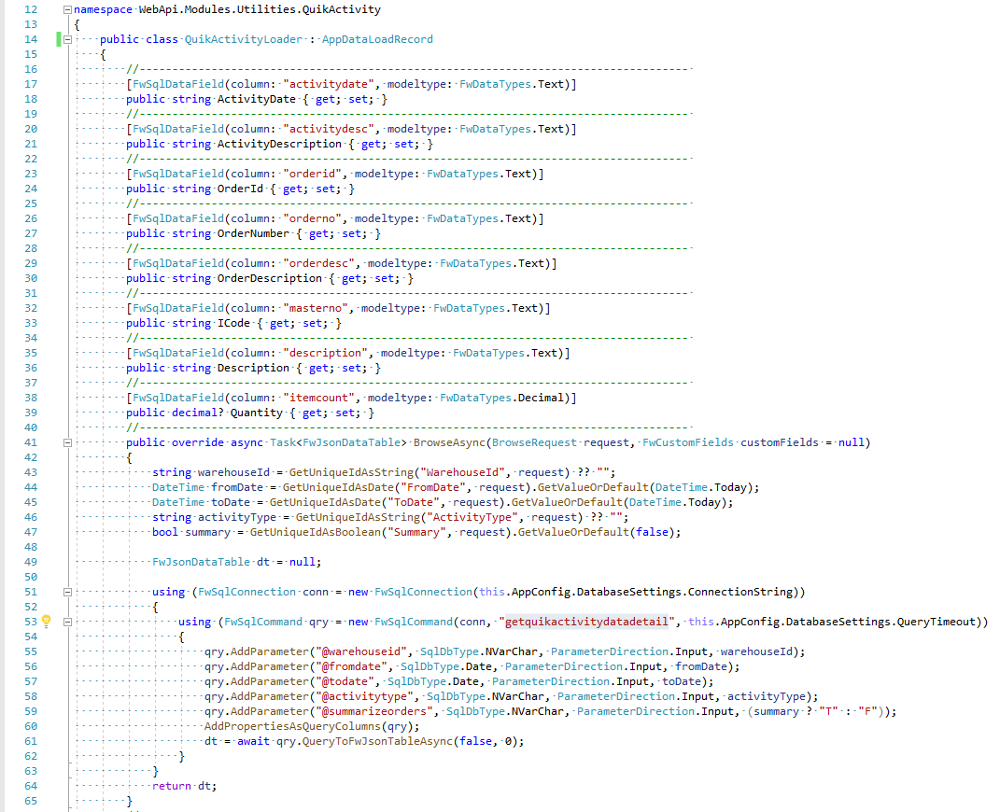
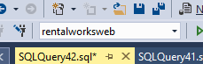
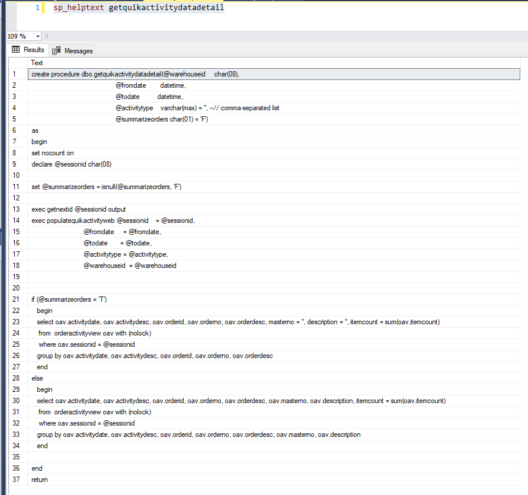
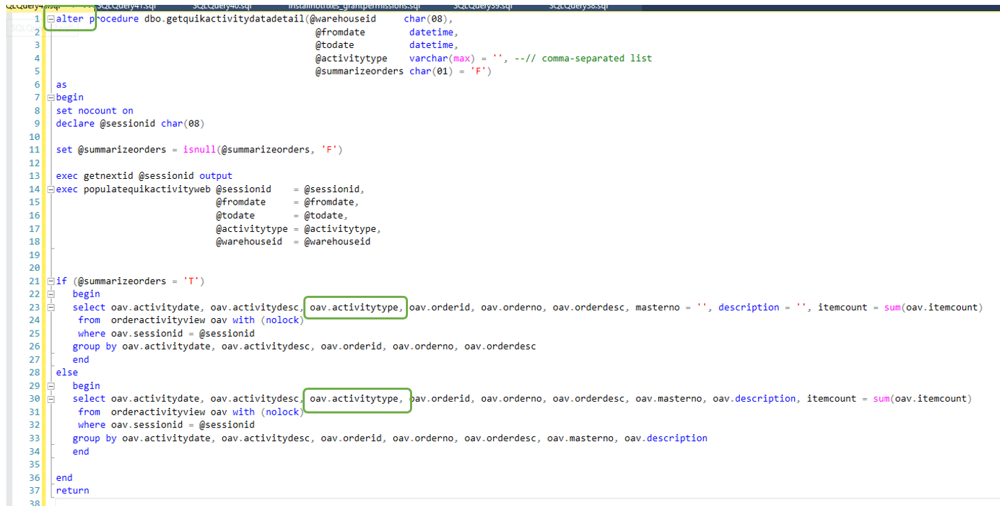
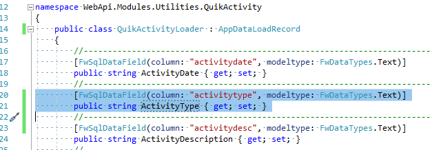
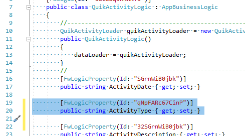

# How to add data fields to a Logical object in the API

Last Updated 08/07/2019

## Logic and Loader classes
- Locate in the Solution Explorer the directory containing the module to expand:

   
- Open the logical class and determine the class of the Loader:

   
- Review the loader class to find the name of the table, view, or stored procedure that loads the data.  Copy the name of the table, view, or stored procedure to use it later.
   

## Loaders that use Views or Tables to load data
- Need more info here

## Loaders that use Stored Procedures to load data
- Open SQL Server Management Studio.  Login and select the correct database:

   
- Execute this command (paste the name of the stored procedure copied above):
```
sp_helptext getquikactivitydatadetail
```
- Output will look like this:

   

- Copy the SQL from the results area and open a New Query Window to paste the SQL code.

   

- Modify the SQL as needed. Change the word "create" to "alter" on the top line.  And add any data fields in the output section(s) at the bottom.

   

- Click the "Execute" button to apply the new SQL to the database.

   


## Modify the Loader class
- Go back to the C# Loader class and add the fields that you added to the SQL.  The "column" value on the first line should be the name of the data field that you added in the SQL. The name of the field on the second line will be the user-friendly name that will be used by the API and front-end.

   

## Modify the Logic class
- Go back to the C# Logic class and add the new fields.  The field name must match the user-friendly field you added to the Loader.  Each new field must have a unique "Id" value on the top line.

   

## SQL Hotfix
- Once everything is working, the modified SQL must be added to the system. This is done by Hotfixes.  Save the SQL and send to Justin to be published to the hotfix servers for distribution to all sites.
