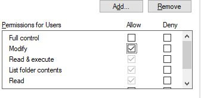

# How to Release RentalWorksWeb

Last Updated 08/05/2019

## Build a Release
- Navigate to the "build" directory: %DwRentalWorksWebPath%\build
- Delete all files and directories in the build directory
- GitKraken: confirm that you are on local\develop branch
- Stash any unstaged changes
- Modify version.txt file in the root of the Web project (save and close)
- Modify version.txt file in the root of the WebApi project (save and close)
- Modify version-RentalWorksWeb.txt file in the root of the WebApi project (save and close)
- Change build mode to Release - Any CPU
- Rebuild Solution
- Publish WebAPI:

   Open PowerShell window at WebApi directory
```
cd %DwRentalWorksWebPath%\src\RentalWorksWebApi
npm run publish

```
- Stage, Commit, and Push assembly/version files, provide Description similar to "web: v2019.1.1.X"
- Navigate to the "build" directory: <repo root>\build
- Use 7Zip to compress the RentalWorksWeb and RentalWorksWebApi directories together "RentalWorksWeb_2019_001_XX.zip"
- Upload zip file to ftp or web server

## Create a Release Tag in GitHub
- Navigate to the repo on github.com
- Click on Code -> Releases
- [RentalWorksWeb Releases](https://github.com/DatabaseWorks/RentalWorksWeb/releases)
- Click "Draft a new Release"
- Input a Tag name and Release Description

   
- Drag-and-Drop the Zip file in the Release

   
- Click the Publish Release button

   


## Deployment Server info:
4Wall:
- web server is 4WE-LV-RWWEB
- Web path: C:\inetpub\wwwroot\rentalworksweb
- API path: C:\inetpub\wwwroot\rentalworkswebapi
- Install Preview hotfixes on 4WE-LV-SQL14..rentalworkstraining

Database Works:
- web server is WEBDEMO01
- Web path: C:\inetpub\web2019demo.rentalworks.net
- API path: C:\inetpub\webapi2019demo.rentalworks.net
- Install Preview hotfixes on SQLDDEMO03..rentalworks_demo2019


## Update Web: 
- find the target directory
- delete all except:

   .well-known (directory)
   
   App_Data (directory)
   
   Application.config
   
   ApplicationConfig.js.
- Copy over the new deliverable files. (Do not copy the App_Data directory to the target.)

## Update API: 
- find the target directory
- delete all except:

   .local-chromium (directory)

   .well-known (directory)

   appsettings.json
- Copy over the new deliverable files. 
- Right-click "Properties" on temp\downloads directory
- Click on the Security tab, then "Edit"
- Click on the user record IIS_IUSRS
- Check the box for "Modify" in the "Allow" column

   
- Click OK to save
- Open IIS Manager
- Navigate to the RentalWorksAPI Application Pool
- Click the "Recycle" button

