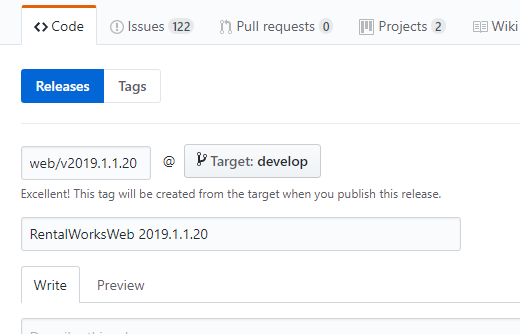
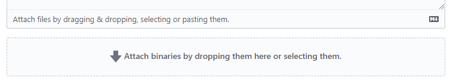
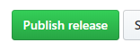

# How to Release RentalWorksWeb

Last Updated 08/15/2019

## Build a Release
- GitKraken: confirm that you are on local\develop branch
- Stash any unstaged changes
- Navigate to the solution root directory: %DwRentalWorksWebPath%
- run the releaseRentalworksWeb.bat file
- Stage, Commit, and Push assembly/version files, provide Description similar to "web: v2019.1.1.X"

## Create a Release Tag in GitHub
- Navigate to the repo on github.com
- Click on Code -> Releases
- [RentalWorksWeb Releases](https://github.com/DatabaseWorks/RentalWorksWeb/releases)
- Click "Draft a new Release"
- Input a Tag version: ie. web/v2019.1.1.24
- Input a Release title: RentalWorksWeb 2019.1.1.24

   
- Drag-and-Drop the Zip file in the Release

   
- Click the Publish Release button

   

## Deployment Server info:
### 4Wall:
#### Production
- web server: 4WE-LV-RWWEB
- database: 4WE-LV-SQL11..rentalworks
- Web path: C:\inetpub\wwwroot\rentalworksproductionweb
- API path: C:\inetpub\wwwroot\rentalworksproductionwebapi
#### Training
- web server: 4WE-LV-RWWEB
- database: 4WE-LV-SQL14..rentalworkstraining
- Web path: C:\inetpub\wwwroot\rentalworkstrainingweb
- API path: C:\inetpub\wwwroot\rentalworkstrainingwebapi

### Database Works:
#### Demo
- web server: WEBDEMO01
- database: SQLDDEMO03..rentalworks_demo2019
- Web path: c:\inetpub\web2019demo.rentalworks.net
- API path: c:\inetpub\webapi2019demo.rentalworks.net

## Update Web and API:
- copy the upgradeRentalworksWeb.bat file to the desktop on the target web server
- Edit the .bat file by providing the web path, api path, and application pool name at the top.
- run the upgradeRentalworksWeb.bat file
